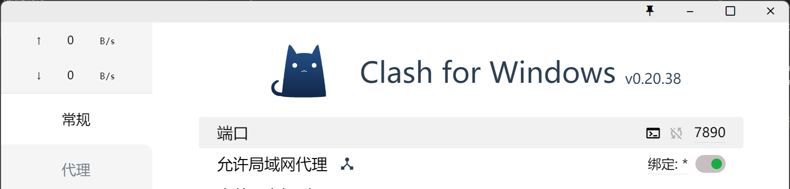
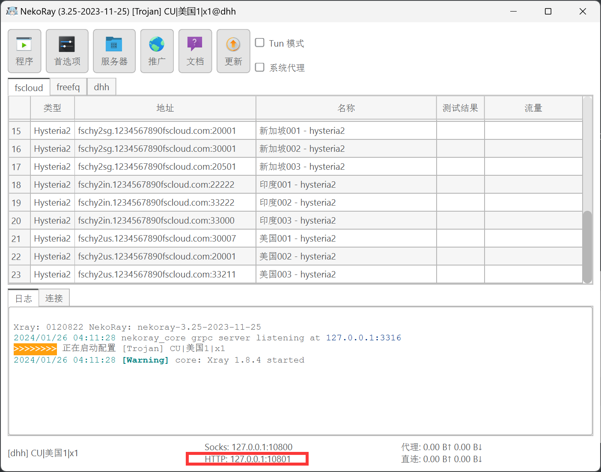

# sparkle_resplace

发光点识别＋星星绘制特效

# 0. 刚刚手欠把仓库名改了，如果出现报错：
```
error: src refspec min does not match any
error: failed to push some refs to 'https://www.writebug.com/git/pttsrd/sparkle_resplace.git'
```
需要
```
git remote set-url origin https://www.writebug.com/git/pttsrd/sparkle_resplace.git
```

# 1. 克隆本仓库

```
git clone https://www.writebug.com/git/pttsrd/sparkle_replace.git
```
###  可能出现的问题
如果你在校外，可能会发现打开梯子仍旧链接不上仓库，因为gitbash或者cmd不经过你的代理这时需要在git bash中输入以下两行：

```
set http_proxy=127.0.0.1:梯子端口
set https_proxy=127.0.0.1:梯子端口
```
`梯子端口`可在你的梯子里找到，比如：



或者




# 2. 切换到本仓库

```
cd sparkle_repalce
```


# 3. 安装jupyter notebook

```
pip install jupyter
```


### 可能遇到的问题

pip需要更新

```
python -m pip install -U
```

# 4. 打开jupyter notebook

在仓库目录下打开cmd中输入

```
jupyter notebook
```

此时，一般会自动帮你打开浏览器


# 5. 打开 `*.ipynotebook`文件
